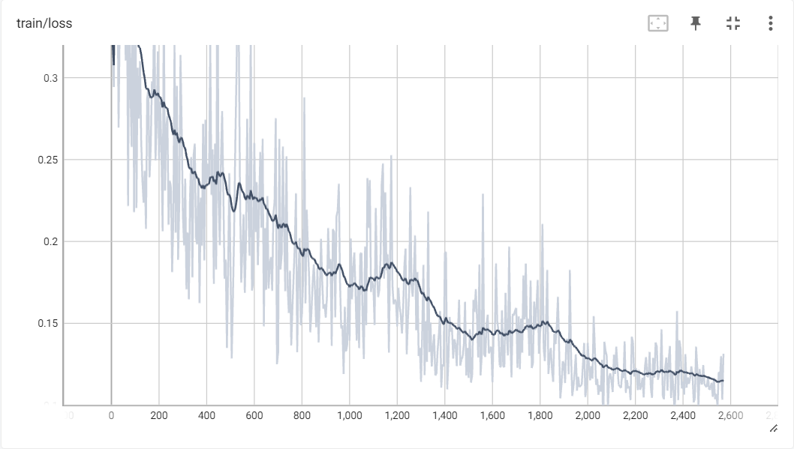

# Kirundi_Teacher

Kirundi is a low referenced language, meaning there's not a lot of ressources online in this language.
That explains why LLMs (specially open source LLMs) have a hard time comunicating in this language.

With that in mind, I decided to finetune an LLM into answering questions about the Kirundi language.

## Dataset creation
The first hurdle I encountered was to find an appropriate dataset for this use-case. 

Expectedly, I didn't find one, so I decided to create my own.

### Protocole
I went on ChatGPT and ask it to generate a json file ['question','answer'].After some try and error, the most satifiing prompt was the following: "You are a Kirundi expert. Your goal is to generate a jsonl file of question and answer about the Kirundi language. Generate 100 unique sample.".

After repetiting this process N times, I gathered a dataset of around 2000 unique rows.

## LLM choice
Since I have limited to using Google Colab. My ressources limits me on using a 7b parameter model, and the best open source one a the moment of this size is Llama 2 (*insert leaderboard*). 

## Data pre-processing
The next step was to treat that dataset   of first to create a dataset of Kirundi content. More specifically a dataset of ['question','answer']

## Training 

### Results

### Inference

## Web interface (UI)
